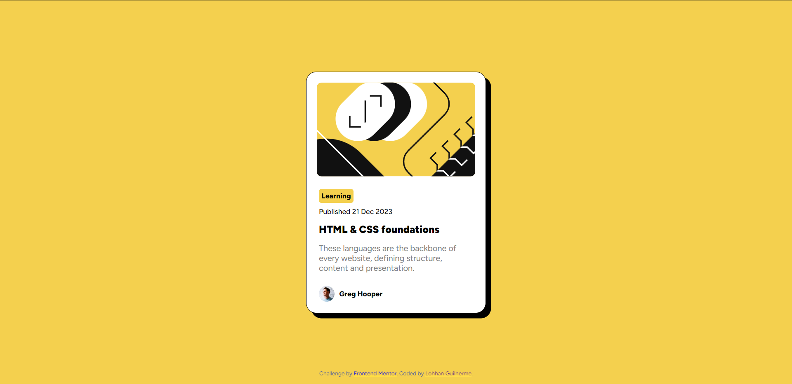

# BlogPreviewCard

Este projeto, chamado BlogPreviewCard, foi desenvolvido como um exercício simples para praticar HTML e CSS, com foco em conceitos de responsividade. A ideia por trás deste projeto era criar um cartão de pré-visualização de blog que se adaptasse bem a diferentes tamanhos de tela, proporcionando uma experiência de usuário consistente em dispositivos móveis e desktops.

Este projeto foi realizado como parte dos desafios propostos pela plataforma Frontend Mentor, que oferece uma variedade de projetos para praticar habilidades de desenvolvimento web. Ao completar este desafio, foi possível aprimorar o conhecimento em HTML, CSS e design responsivo, além de desenvolver habilidades de resolução de problemas e prática de layout.

